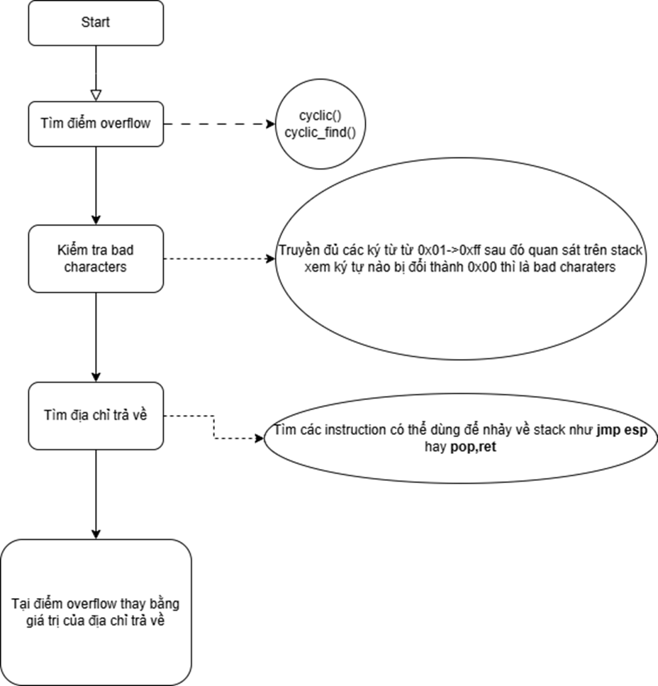

# Các bước thực hiện tấn công

# Note
## pwntools
- cyclic(size): tạo chuỗi duy nhất có độ dài là size

- cyclic_find('\x11\x22\x33\x44'): tìm vị trí chuỗi 0x44332211 

- remote(host, port): kết nối tcp đến host bằng cổng port

- send(data)/sendline(data): gửi dữ liệu qua kết nối tạo bởi remote

- close(): đóng kết nối tạo bởi remote

- p32(0x11223344): Đổi địa chỉ 0x11223344 thành dạng chuỗi 
